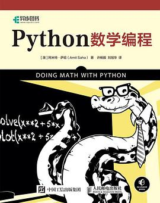

# doing-math-with-python
Python数学编程：



# 评价

比较薄的一本书，标价是59人民币，如果这个价格买肯定是不划算的，但是现在的书籍都是标的价格高，但是实际卖的价格低，所以打折入手的话其实没有什么问题。

书籍涉及到的数学知识点并不复杂，这本书的定位是一本入门的使用Python做一些简单的数学的书籍，所以以内容的浅显要评价这本书其实是不妥的，因为本来就是简单的入门书。

作者的代码风格还是比较值的推荐的，虽然是关于数学的书籍，但是很多代码都是写的非常的严谨，比如说大部分都是给出了：

```python
if __name__ == '__main__'
```

甚至一些关于Python项目实践的数据都没有这样做，不过我主要还是在jupyter lab上实现的书籍的内容。
